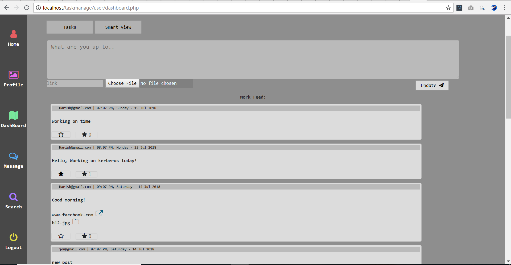

# Task-Management-for-small-organizations
- Assign tasks
- Submit tasks
- Social platform as work-feed
- Prioritize tasks which has to be completed by clients/employees
- File sharing.
- Interaction
- Has Connection between clients/employees.

Curently working on this project, Will update once it's completely done.

Social platform for employees to share thoughts, Ideas, Updates with the whole team known as work-feed:

This is how tasks look:

Admin can talk with whole team in social work-feed page, or talk seperately with member, View uploaded/submitted tasks, Employees status, Assign task:

This is how leader can assign tasks for one member or multiple members:

Real-chat message system: For interation between employees. First loads only 30 newer messages, later can/will load all:

